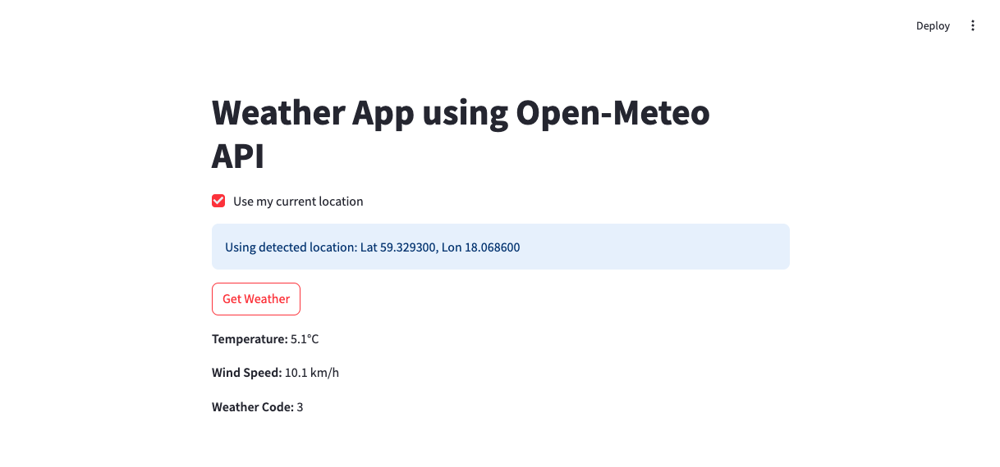

# Introduction

This repository is a playground for a 4 hours AI coding workshop, in which the participants will learn to work with the AI in different roles to assist them with programming, using several techniques.

Some of the roles the AI can take and the respective tasks it can assist with:

- "junior developer":
    - write a function
    - implement an isolated feature from scratch
- "mid developer":
    - add a new feature into an existing project
    - add tests
    - refactor code
- architect:
    - create high level design and architecture
- pair programming assistant
    - understand and document already-written code
    - run the existing project
    - translate code to a different programming language
    - troubleshoot the errors

# Prerequisites

**LLM accounts**:
- Create a free account, if you don't have one yet, on one or more of:
    - https://chatgpt.com/
    - https://claude.ai/
- (optional, highly recommended) Install Cursor IDE: https://www.cursor.com/

**Python prerequisites**:

- Install python: https://www.python.org/downloads/
- Install `venv` by running `python -m pip install venv`
    - note: this will not work on some Linux distros, the correct way is to go via the system's package manager instead, eg. on Ubuntu: `sudo apt-get install python3-venv`
- Clone this repository
- In the root folder, run the following commands to create the virtual environment, activate it and install the requirements:

Unix/MacOS:
```bash
python -m venv venv
source ./venv/bin/activate
pip install -r ./requirements.txt
```

Windows (Powershell):
```powershell
python -m venv venv
.\venv\Scripts\Activate.ps1
pip install -r .\requirements.txt
```

While the virtual environment is activated, test that the example works by running:

Unix/MacOS:
```bash
python -m streamlit run ./src/weather.py
```

Windows:
```powershell
python -m streamlit run .\src\weather.py
```

Navigating to `localhost:8501` in your browser, you should see approximately the following:



# Workshop Schedule

- 15 minutes: introduction
- 40 minutes: an overview lecture
  - including the first task introduction & break down in pairs

- 5 min: break

- 45 minutes: work in pairs
- 10 minutes: group discussion

- 15 min: break

- 5 minutes: second task introduction
- 45 minutes: work in pairs
- 10 min: group discussion

- 5 min: break

- 5 min: third task introduction
- 35 min: work in pairs
- 5 min: conclusions

# Task instructions

Write a self-contained weather forecast app in Python, using the [Streamlit](https://streamlit.io/) UI library.

The app should be able to:

- take a location as an input
- (optional) detect current location based on the IP address
- show a 7 days forecast for:
    - day/night temperature
    - precipitation level
    - wind speed
- show an hourly chart for the forecasted temperature over the next week
- show an hourly chart for the forecasted precipitation over the next week

You can use the following APIs:

- https://api.open-meteo.com/v1/forecast for the actual forecasts
- https://nominatim.openstreetmap.org/search for searching a city
- http://ip-api.com/json/ for detecting location based on the IP address


## Part 1

1. For this part we start from an existing template in `src/weather.py`.

First, start the app by running:

under Unix/MacOS:
```bash
python -m streamlit run ./src/weather.py
```

...or under Windows:
```powershell
python -m streamlit run .\src\weather.py
```

2. Ask the LLM to:

- explain the code in `weather.py`
- clean up / add documentation in the code

3. Once you are comfortable with what the existing code does, ask the LLM to implement the logic according to the project specifications. Try:
    1. copy-pasting the entire project spec into LLM and see how far you can get:
        - did the LLM follow all the instructions?
        - are all specified features present?
        - are there some hallucinations, eg. non-existing/deprecated API paths?
    2. going step-by-step instead and see how the end result differs:
        - is it easier to guarantee that all of the specifications line up?
        - does the LLM make changes in a structurally coherent way?
        - is there more "code spaghetti" this way?


## Part 2

1. Together with the LLM, write a design document. A good way to start is to describe the desired functionality to the LLM, then ask it to write a design outline, do some iterative adjustments, and when you are happy with the result, ask it to write the actual design.

2. Put the resulting design document in the repository. This would be our "ground" context, that we will include in every interaction with the LLM from now on.

3. Implement the weather app again, this time starting entirely from scratch, just with the design document. Flesh out the bits of functionality one by one, while at all times keeping the overall end goal design in mind.

## Part 3

1. Continue from where you left in the previous task.
2. Choose one or more stretch goals:
    - translate the project into a language of choice (suggestions: C#, Typescript/React)
    - add a build/start script
    - add unit tests
    - refactor the code, eg.:
        - split the logic from the visualization
        - move data fetching functionality into separate module(s)
